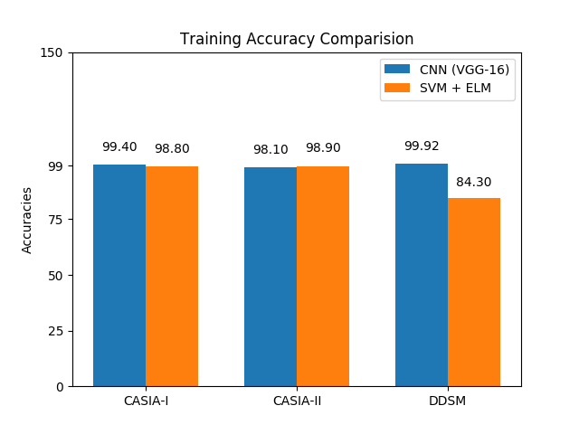

#### Detection of Digital Image Forgery using Deep Learning

<B>Paper</B>: NA

<B>Abstract</B>: 

The rapid growth of new communication techniques and abilities, new services and facilities are provided in health care industries with some software framework which can help the doctors to reduce the manpower to do repeating jobs and allocate the time on different important things. The features and functionalities are aiming to provide an easy to use and accurate health care services.Considering health is main vital concern for any person’s privacy so the data related to health care also should be taken care of utmost priority and security.   Also it’s being seen that many people take the output of this software and then alter, modify, or forge it to claim medical allowances, insurances etc. To prevent such behavior, we are trying to implement a system which improves the accuracy of the system compared to the existing tools or software to resolve the problem. We are trying to build a new image forgery detection method based on deep learning techniques that utilizes a constitutional neural network(CNN). In the model, we will try to improve the accuracy of detecting forged images compared to already implemented tools, software or techniques.  We have used 80-20% train-test split approach to achieve the 99.8% training and 87.5 testing accuracy on CASIA I and 98.2 training and 85.2 testing accuracy on CASIA II dataset. However applying the same technique for DDSM dataset, it leads to 99.8 training accuracy and 99.4 testing accuracy.

<B>Dataset</B>: 

1. CASIA - https://www.kaggle.com/sophatvathana/casia-dataset
2. DDSM - https://wiki.cancerimagingarchive.net/display/Public/CBIS-DDSM

<B>Setup Instruction</B>: 
Soon..

<B>Accuracies</B>: 

